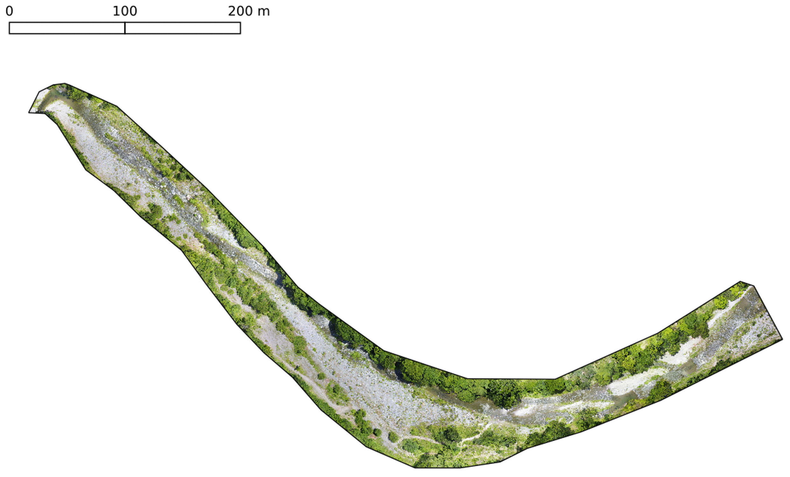
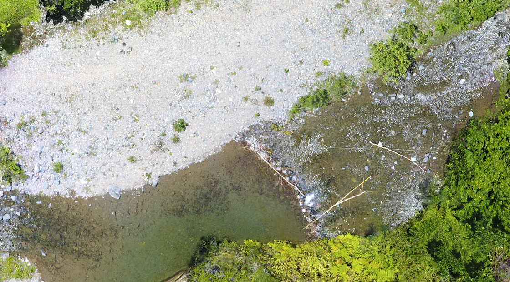

# Geomorfología de detalle de un tramo de 1 kilómetro del río Mana, proximidades de Villa Altagracia, República Dominicana

[](https://zenodo.org/badge/latestdoi/212830847)


*XVIII Jornada de Investigación Científica, UASD*

*12, 13 y 14 de noviembre, 2019*

*Santo Domingo, República Dominicana*

**Sometimiento de resumen**

| | |
|:--|:-----------|
| **Título:** | Geomorfología de detalle de un tramo de 1 kilómetro del río Mana, proximidades de Villa Altagracia, República Dominicana |
| **Tipo de participación:** | Oral |
| **Nombre de autores:** | José Ramón Martínez Batlle<sup>1</sup>, América Sánchez Rosario<sup>2</sup> |
| **Institución/Facultad:** | <sup>1</sup>Facultad de Ciencias, UASD; <sup>2</sup> IIBZ, UASD |
| **Resumen:** | Los atributos geomorfológicos de un río son relevantes porque dirigen, entre otras cosas, la composición y distribución de su biodiversidad, los riesgos por inundación y sus características hídricas. Tradicionalmente, los rasgos geomorfológicos se obtenían procesando fotografías aéreas de escala media (e.g. 1:20,000) o imágenes de satélite de resolución métrica, lo cual permitía reconocer elementos morfológicos de orden métrico o decamétrico. Sin embargo, cámaras a bordo de sistemas aéreos pilotados remotamente (RPAS, UAV, "drones") obtienen imágenes de resolución centimétrica e incluso milimétrica, con las que es posible reconocer rasgos tan específicos como la granulometría general de los depósitos fluviales. Las técnicas de fotogrametría digital han evolucionado conjuntamente con el desarrollo de los drones y, aunque existen servicios de pago en "la nube" y software privativo para realizar restituciones fotogramétricas, las herramientas abiertas y libres son idóneas en entornos académicos. Utilizando imágenes de resolución centimétrica tomadas por dron entre junio y agosto de 2019, y procesadas con OpenDroneMap, QGIS y otros paquetes de código abierto, se generó un mapa geomorfológico de escala de detalle de un tramo de 1 kilómetro del río Mana, próximo a El Cidral. Los principales elementos detectados son: bancos medianos y barras laterales de granulometrías variadas (bloques, gravas), acumulaciones de bloques, secuencias rápido-poza (*riffle-pool*), zonas de corrientes, entre otras. La mayoría de estas formas y depósitos no podrían ser detectadas con fuentes tradicionales. La información generada es de gran utilidad, especialmente para estudios de fauna y flora asociada al río y su ribera. Los resultados del presente trabajo, se aprovecharon para estudiar patrones de asociación de macroinvertebrados acuáticos (especialmente insectos) con las características geomorfológicas del río. |
| **Palabras clave:** | geomorfología fluvial, cartografía geomorfológica, UAV, fotogrametría digital, código abierto |

[Presentación de diapositivas](https://geofis.github.io/geomorfologia-detalle-tramo-1km-rio-mana/)






* Citar como:

José Ramón Martínez Batlle, & América Sánchez Rosario. (2021, March 11). geofis/geomorfologia-detalle-tramo-1km-rio-mana: First release (Version v0.0.0.9000). Zenodo. http://doi.org/10.5281/zenodo.4599721

* Entrada BibTeX:

```
@software{jose_ramon_martinez_batlle_2021_4599721,
  author       = {José Ramón Martínez Batlle and
                  América Sánchez Rosario},
  title        = {{geofis/geomorfologia-detalle-tramo-1km-rio-mana: 
                   First release}},
  month        = mar,
  year         = 2021,
  publisher    = {Zenodo},
  version      = {v0.0.0.9000},
  doi          = {10.5281/zenodo.4599721},
  url          = {https://doi.org/10.5281/zenodo.4599721}
}
```