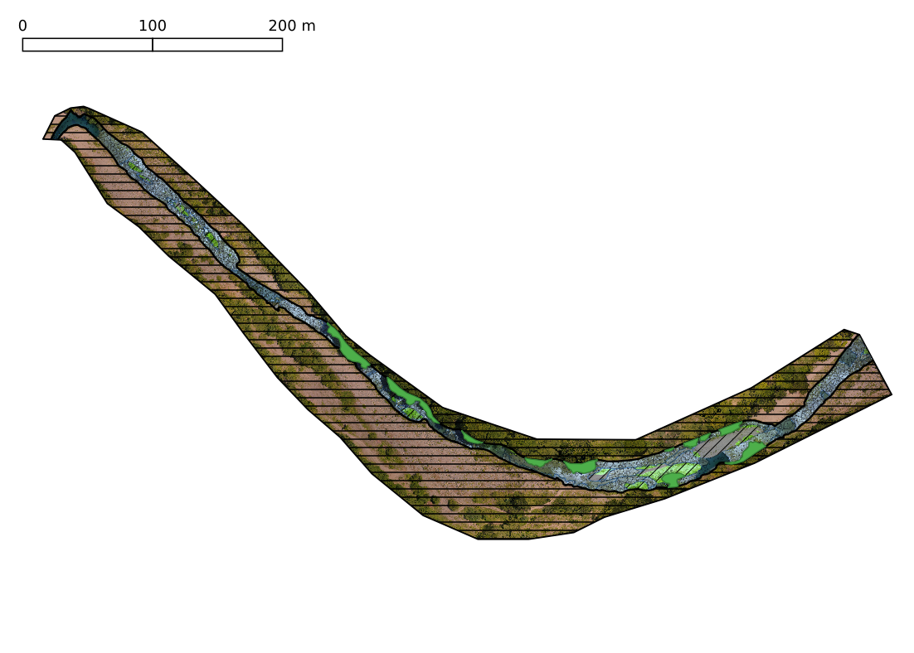

```{r setup, include=FALSE}
knitr::opts_chunk$set(echo = FALSE)
```

# Introducción

## ¿Pregunta?

* ¿Se puede clasificar la geomorfología utilizando sólo la información óptica de una ortoimagen?

## Principales elementos de geomorfología fluvial

## 

Según @pedraza1996geomorfologia

## 
Según @elorza2008geomorfologia

## 
Según @elorza2008geomorfologia

## 

Según @bunte2001sampling

## Antecedentes

## 

## 

## 

<!-- ##  -->

## 

## 

# Materiales y métodos

## Materiales

* Drone + cámara.

* GNSS-RTK

* PC de "alto" rendimiento + Python + OpenDroneMap + GDAL + QGIS + R

{width=75%}

## Método

## {width=59%}

# Resultados

## ¿Dónde están los resultados?

{width=90%}
<small>Por el momento, aquí: https://github.com/geofis/geomorfologia-detalle-tramo-1km-rio-mana</small>

## 

## 

## 

## 

## 

## 

## 

## 

## 

## 

## 

## 

##

* Unidad 1: canal activo de lecho __gravas, bloques dispersos y pozas artificiales__. No dosel de galería.

* Unidad 2: ancho canal activo de lecho mixto, __con rápidos, isla y barras__. Dosel de galería presente.

* Unidad 3: canal activo estrecho de lecho mixto (más bloques), __alternancia de rápidos y pozas__. Segmentos largos de dosel de galería.

* Unidad 4: canal activo de lecho de bloques predominantes, __rápidos, pozas y barras__. No dosel de galería.

* Unidad 5: __Poza profunda__, sustrato aflorante. No dosel de galería.

## Muestras de macroinvertebrados colectadas en julio de 2019

## 

## 

## 

# Conclusiones

##

* La __fotogrametría digital__ aplicada a tomas aéreas tomadas por UAV, permite realizar __mapas geomorfológicos de detalle suficiente__ como para clasificar elementos morfológicos extremedamente pequeños (barras/islas, incluso segmentarlas, pozas, rápidos, depósitos de bloques, granulometría del fondo).

* Se establecen al menos __5 unidades__ de acuerdo a las características geomorfológicas del canal.

* Se espera __combinar estos resultados con análisis de comunidades__ de macroinvertebrados acuáticos, tomadas a intervalos cortos y regulares.

# Referencias


##

