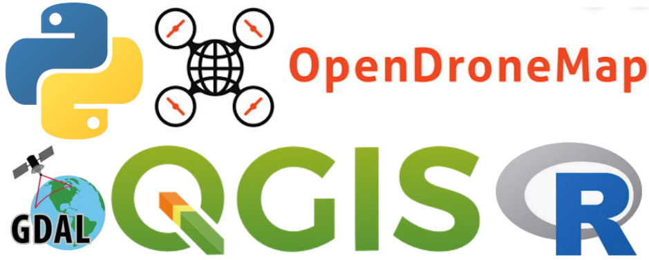
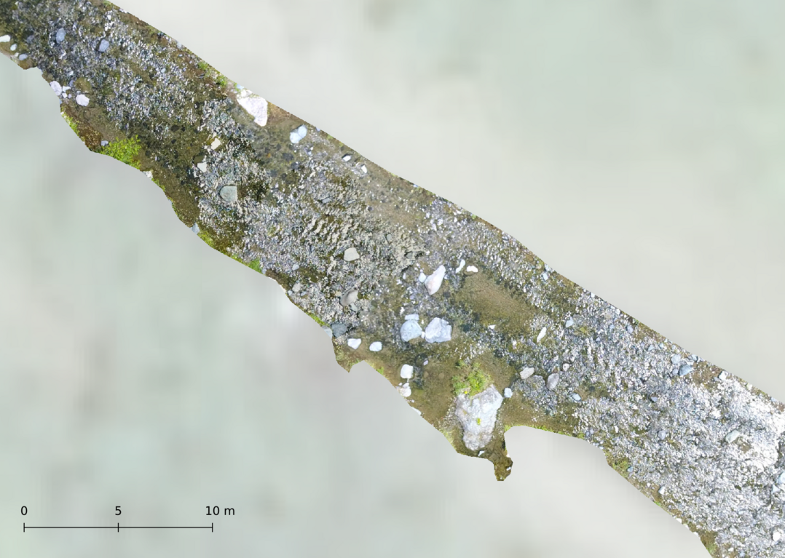
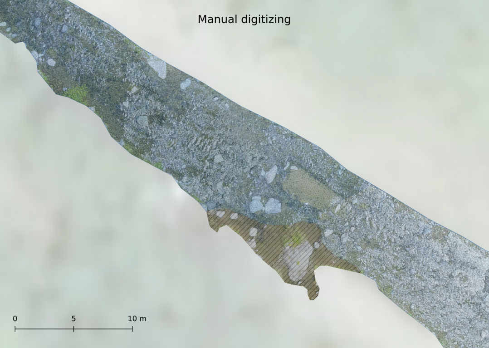

```{r setup, include=FALSE}
knitr::opts_chunk$set(echo = FALSE)
```

# Introducción

## ¿Pregunta?

- ¿Es la geomorfología extraíble desde fotografías aéreas por medio de algoritmos de aprendizaje profundo?

## Principales elementos de geomorfología fluvial

## 

Según @pedraza1996geomorfologia

## 
Según @elorza2008geomorfologia

## 
Según @elorza2008geomorfologia

## 

Según @bunte2001sampling

## Localidad

## 

## 

## 

<!-- ##  -->

## Antecedentes

## 

## 

# Materiales y métodos

## Materiales

* Drone + cámara.

* PC de "alto" rendimiento + Python + OpenDroneMap + GDAL + QGIS + R

{width=85%}

## Método

## {width=59%}

# Resultados

## ¿Dónde están los resultados?

{width=90%}
<small>Por el momento, aquí: https://github.com/geofis/geomorfologia-detalle-tramo-1km-rio-mana</small>

## Imagen fuente

- La imagen fuente cubre un tramo de 1 km del río Mana, Villa Altagracia, con una resolución centimétrica (2 cm/pix, ~500 Mpix x 3 canales)

## 

## 

## 

## 

## 

## 

## 

## 

## Clasificación

- La imagen fuente fue clasificada en 7 clases siguiendo el flujo preparación > RF > U-Net

- La clasificación final por U-Net supera todos los estándares.

<!-- FALTA IMAGEN CLASIFICADA VISTA COMPLETA -->

## Clasificación U-Net

{width=40%}

- Las clases geomorfológicas obtenidas fueron: __clastos-barras, rápidos y pozas__.

- Otras clases obtenidas fueron: __vegetación baja, vegetación de ribera, sombra de vegetación__.

## Precisión

- El **cálculo tradicional de precisión simple** (e.g. métodos basados en kappa) para segmentación semántica no es apropiado, dado que el fondo (que normalmente ocupa grandes extensiones) **infla de manera ficticia la precisión**.

- De hecho, la segmentación obtuvo un __99% de precisión__ por el método tradicional, pero esto es irreal y, de hecho, preocupante, porque sería una señal de sobreajuste.

- Lo apropiado es utilizar "__intersección sobre unión__", que en este caso obtuvo __un 88%__.

- La clase con menor precisión fue sombra de vegetación, por ser la menos representada en el área.

## Zoom

## 

## 

## 

## 

## 

## 

## 

## 

## Conjunto


## Conjunto del área central


# Discusión

## Discusión y conclusiones

- La __geomorfología es extraíble__ desde fotografías aéreas por medio de algoritmos de aprendizaje profundo.

- Los productos de la __fotogrametría digital__ de tomas aéreas por UAV, procesados por medio de __algoritmos de aprendizaje automático y aprendizaje profundo__, son precisos.

- El uso de técnicas de __machine learning__ de forma auxiliar, aumenta los datos de entrenamiento sin que se reduzca la precisión.

## Discusión y conclusiones

- Las __limitaciones informáticas__ se pueden suplir con servicios en línea (e.g. Google Colab).

- El __uso del DSM__ en las fases de entrenamiento y de predicción, podría potenciar el resultado obtenido.

- __Combinar estos resultados con análisis de comunidades__ de macroinvertebrados acuáticos es ahora __completamente viable__ a partir del exhaustivo mapa producido.


## 

## 

## 

## 

## Muestras de macroinvertebrados colectadas en julio de 2019

## 

## 

## 

# Referencias

<section style="font-size: 24px; text-align: left;">